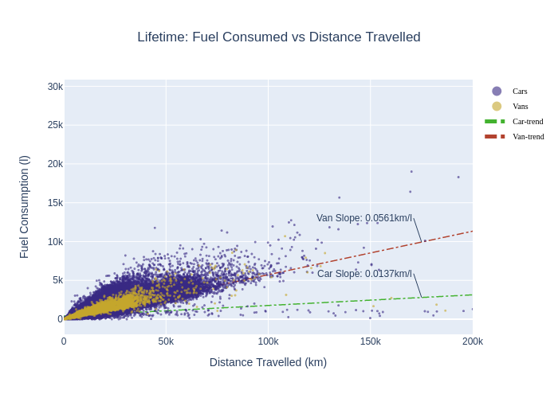
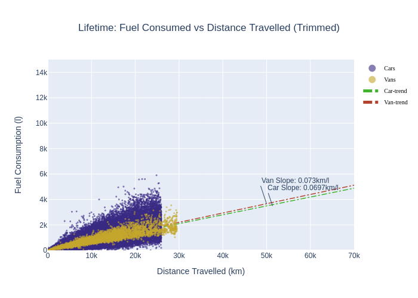
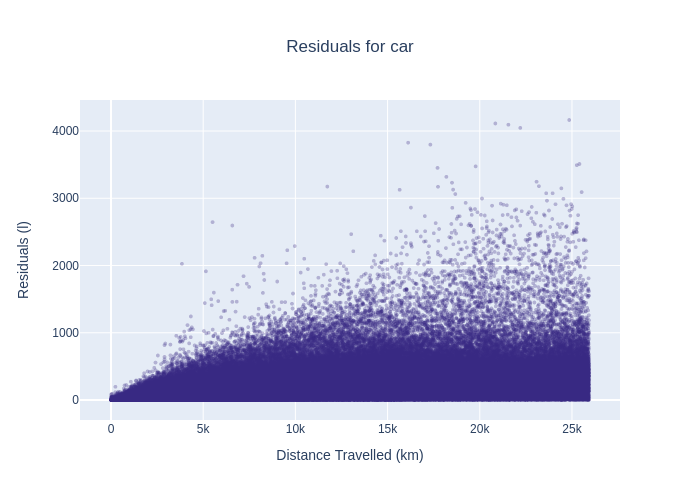
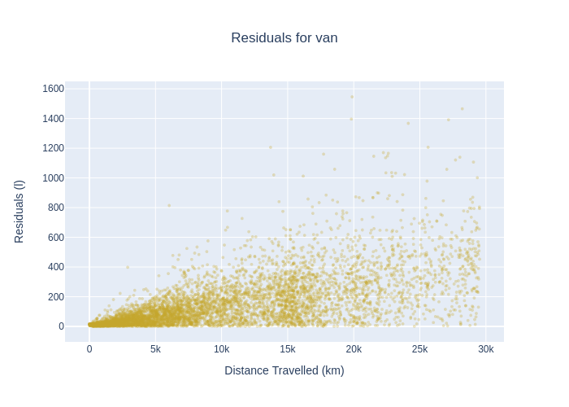
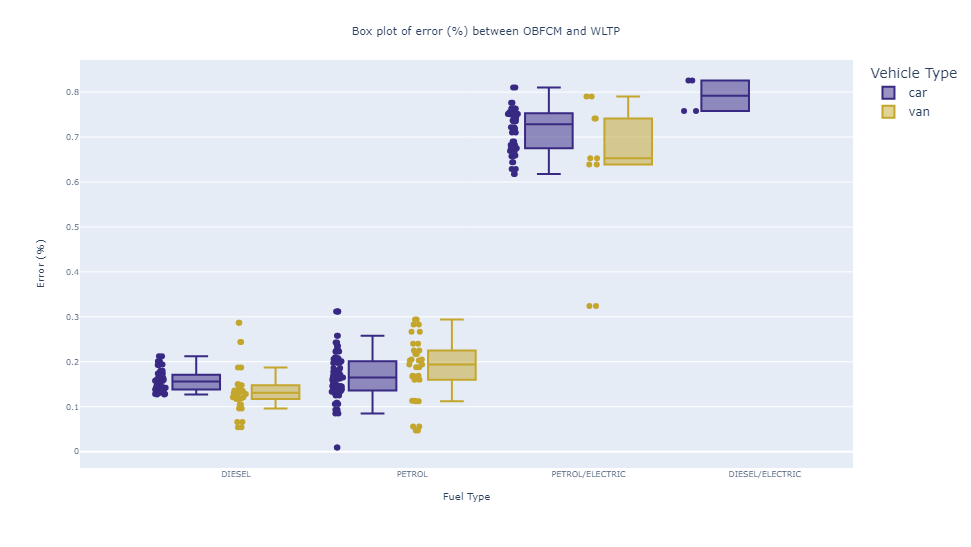
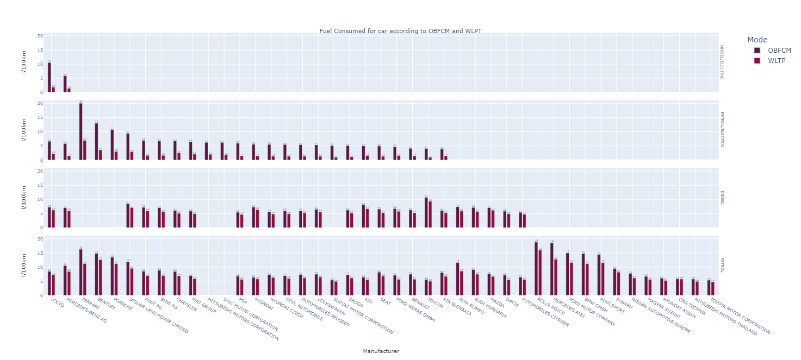
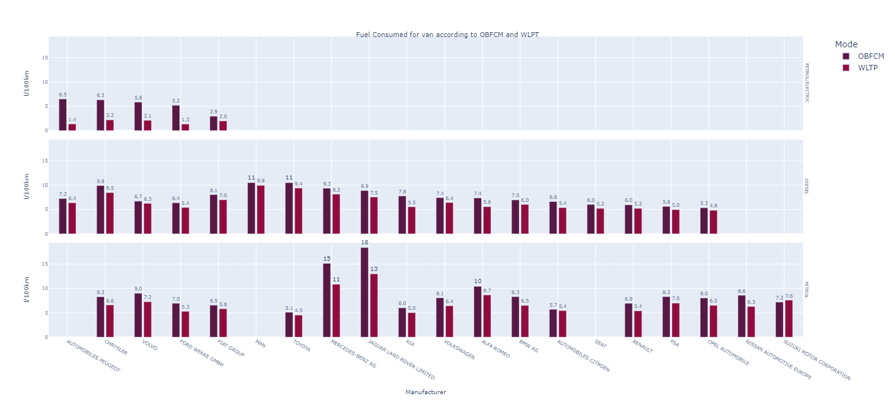

## Exploratory Analysis: Fuel Consumption Monitoring

I carried out an exploratory analysis of the dataset real-world CO2 emissions of cars and vans. This dataset is collected in 2021 from fuel consumption monitors installed on-board. I concentrated the analysis around 3 questions:
1. Relation between total lifetime fuel consumed (l) with distance travelled. Linear Regression univariate to know the trend. In other words, km/l relation.
2. Error difference between WLTP and OBCM (l/100km), represented as boxplot graph.
3. Types of fuel and their total consumption for OBCM and WLTP monitoring methods as a function of the brand.

For the first question, I plotted the scattered data of liters and total kilometers travelled for all brands separated for vans and cars. We can observe, that car data is more spread, there are more variabilty. This is logic, knowing that there are a lot of different car brands with different motor capacity. I fitted a simple Linear Regression in order  to see the ratio of Km travelled/Total Fuel consumed (l). On the graph without trimming, in the case of vans, the ratio is greater, meaning that the impact of low-fuel consumption cars are making a high impact,  lowering the ratio. Whenever I trimmed the data, removing extremes data points, both ratios get very close. This behaviour grasp the fact, that the bulk of data for vans and cars more or less consume the same, around 0.0715 l/km.  THe following table compares all model metrics.

  
  

| Model | Mode | Vehicle Type| R2 | R2 in OLS| MAE | t-statistic|
| :---:         |     :---:      |          :---: |     :---:      |  :---:      |      :---:      |  :---:      | 
| LR  | training |car| 0.17777    | 0.265 |390.63244    | 575.261  |
| LR  | training |van| 0.76538   | 0.824  |390.63244  |  240.272
| LR trimmed | training |car| 0.85660    | 0.914   |87.56700    | 3040.267 |
| LR trimmed | training |van| 0.91584    | 0.944   |87.09670   | 443.840  |

The following plots represent the residuals along all kilometers. This approach aims to detect the magnitude of the error along X. Both graphs behave almost equally, providing low error at the beginning and increasing and spreading along X axis.

  
  

For the second question, is important to know first, that OBFCM and WLTP are different methods used for monitoring and measuring fuel consumption. OBFCM is an on-board sensor and WLTP is a more test-based method in laboratory.
The following graph shows the gap between the fuel consumed marked in OBFCM and WLTP. Important to observe, that PETRO/ELECTRIC motor-type are the most inaccurate of all 3, with the exception of DIESEL/ELECTRIC, which we do not have enough information. It is represented in percentage to avoid bias of the total fuel consumed depending on the motor-type.

    

 

For the third question, I plotted an histogram showing the total fuel consumed in liters in 100 km for all brands and for both monitoring methods. I recommend to download and open those html files for better visualization. It is interesting to observe, that brands with high fuel consumption ratio contain the greatest gap error. I can interpret looking at this graph that having luxurious brands is directly proportional to high fuel consumed.

In addition, we can confirm that the top manufacturers with most fuel consumed for petrol are: 
1. Rolls Royce
2. Mercedes AMG
3. Ferrari (top 1 in PETROL/ELECTRIC)

For vans vehicles Diesel-type consumption is almost homogenously, with the exception of MAN and Toyota. For petrol group we have:

1. Jaguar Land Rover Limited
2. Mercedes-Benz AG
3. Alfa Romeo

    

 

    

 
